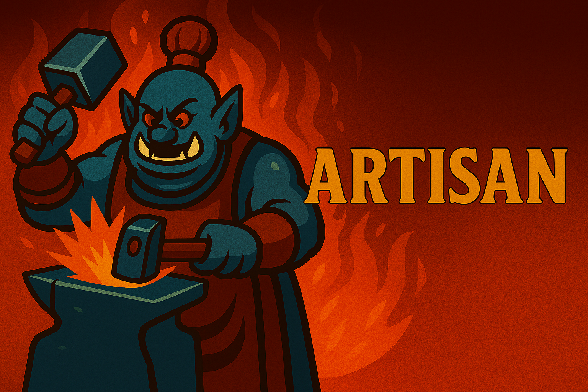

# 🛠️ Artisan

**Artisan** is Compulsion’s custom Discord bot for managing World of Warcraft professions, recipes, and crafter coordination. Built with Node.js and Discord.js, Artisan streamlines guild crafting workflows with precision and polish.

---

## 🚀 Quickstart: Setting Up Artisan for Your Guild

**If you’re starting fresh (e.g., initial install, or after deleting the database), follow these steps:**

1. **Delete the old database file**  
   Remove your SQLite database file (e.g., `guilddata.sqlite`) from the project directory. This step is optional and only needed for a full reset.

2. **Restart the bot**  
   This will recreate the database tables automatically.

3. **Create all Discord roles**  
   Run the following command in your Discord server (admin only):  
   ```
   /admin add-roles
   ```
   This will create all class/spec, main role, and profession roles with appropriate colors.

4. **Sync the guild roster and professions**  
   Run:  
   ```
   /admin sync
   ```
   This fetches the latest roster and profession/spec data from Blizzard and populates the database.

5. **Have members claim their characters**  
   Each guild member should run:  
   ```
   /characters claim <character name>
   ```
   This links their Discord account to their character(s) and automatically assigns the correct class/spec, main role, and profession roles.

   Members can also:
   - List their claimed characters: `/characters list`
   - Set a main character: `/characters setmain <character name>`
   - Unclaim a character: `/characters unclaim <character name>`

---


## 🛠️ Features

- **Automatic role assignment** for class/spec, main role (Tank/Healer/DPS), and professions when a character is claimed
- **Profession and recipe search** with `/whohas` (supports pagination with Next/Previous buttons)
- **Easy guild roster and profession syncing** with `/admin sync`
- **Admin commands** for bulk role management (`/admin add-roles`/`remove-roles`)
- **Character claiming and management** with `/characters` commands
- **/help command** for in-Discord command reference
## ⚙️ Environment Variables

You can configure the bot using a `.env` file in the project root. Key variables:

- `DEBUG_LEVEL` — Set to `info`, `verbose`, or `error` for logging detail
- `SYNC_BATCH_SIZE` — Number of characters to process in parallel during sync (default: 5)
- `WHO_HAS_PAGE_SIZE` — Number of results per page for `/whohas` (default: 10)
- `DISCORD_LIMIT` — Max message length for table output (default: 100)
## 🆘 Commands Overview

**/help** — Show a summary of all commands and features

**/admin sync** — Admin: Sync or refresh guild data from Blizzard API (updates roster, professions, and recipes)

**/whohas <item/recipe>** — Find out who can craft a specific recipe or item (supports pagination with Next/Previous buttons)

**/guild** — Guild-wide listing helpers (autocomplete + pagination):
   • `/guild profession <profession>` — List characters with the specified profession (autocomplete supported)
   • `/guild role <role>` — List characters by main role (Tank / Healer / Melee DPS / Ranged DPS) (autocomplete supported)
   • `/guild class <class>` — List characters of a given class (autocomplete supported)
   • `/guild claimed [mains_only]` — List claimed characters and owner (optional boolean `mains_only` to show mains only)
   • `/guild unclaimed` — List unclaimed characters (class & spec shown)

  Notes:
   - Long lists are paginated and include Next / Previous buttons.
   - Each page shows a "Found N..." line inside the code block so the total number of matching characters is visible.
   - Autocomplete is available for profession, role, and class where noted.

**Interaction behavior and resiliency**

- The bot defers replies for longer queries and uses safe reply/update helpers so that if the original interaction expires the bot will fall back to sending a follow-up message instead of throwing errors. This reduces duplicate-respond and expired-interaction errors (40060/10062).

**Data backfill & maintenance scripts**

- `scripts/check_derived_roles.js` — Inspect the database and report how many characters would be assigned each main role when deriving role from class+spec.
- `scripts/dump_roles.js` — Dump distinct roles and sample rows from the DB to help diagnose missing role values.
- `scripts/backfill_roles.js` — Backfill legacy rows where `guild_members.role` is NULL by deriving role from `spec` + `class`. Run this once after upgrading to the role-derivation logic:

```powershell
node scripts/backfill_roles.js
```

Backfill is idempotent and safe to run in most cases; review the script output before committing changes to production.


**/characters** — Manage your claimed characters:
   • `/characters claim <character>` — Claim a character as your own
   • `/characters setmain <character>` — Set one of your claimed characters as your main
   • `/characters list` — List all characters you have claimed (shows class, spec, main role, and main status)
   • `/characters unclaim <character>` — Unclaim a character you previously claimed

**/admin add-roles** — Admin: Create all class/spec, main, and profession roles
**/admin remove-roles** — Admin: Remove all class/spec, main, and profession roles

---

---

## 🤝 Contributing

We welcome contributions!  
See [CONTRIBUTING.md](CONTRIBUTING.md) for guidelines.

---

## 💬 Support

Need help or want to suggest a feature?  
Ping **@burntorangejedi** in Discord or open an issue at [github.com/burntorangejedi/artisan-bot/issues](https://github.com/burntorangejedi/artisan-bot/issues)

---

**Enjoy!**